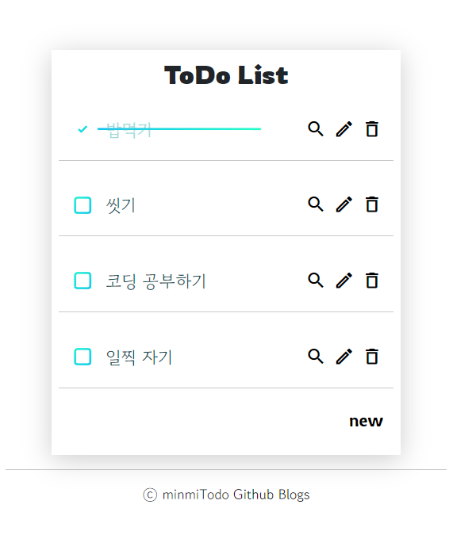
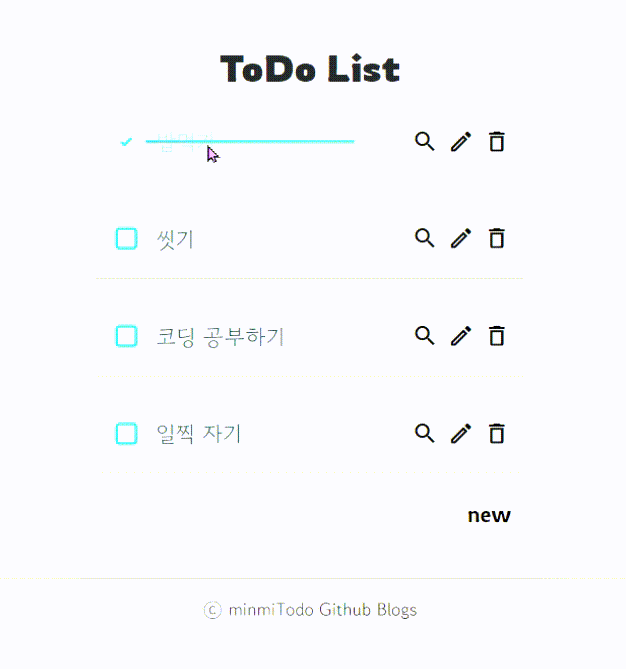

# minni_ToDoApp

Spring Boot 로 제작한 Simple ToDo App 입니다.  

- Front : Mustache
- back : Spring boot
- DB : h2
 
 

---   
   
## ToDo main page   
 

ToDoApp 메인 페이지 입니다.   
할 일 목록을 확인할 수 있습니다.   
 
- 돋보기 버튼을 누르면 **할 일 상세 페이지**로 이동합니다.
- 펜 버튼을 누르면 **할 일 수정 페이지**로 이동합니다.
- new 글씨를 누르면 **할 일 생성 페이지**로 이동합니다.

 

### ToDo check_box
 

할 일을 완료했을 때 체크박스를 눌러줍니다.

 

### ToDo delete
 

완료한 할 일은 쓰레기통 버튼을 눌러서 삭제합니다.   
할 일을 삭제하면 alert 창이 표시됩니다.

 

---
## ToDo create page
 

새 할 일을 등록합니다.   
Back 을 누르면 목록으로 돌아갑니다.

 

---
## ToDo edit page
 

할 일을 수정합니다.

 

---

## ToDo Reference

https://codepen.io/shshaw/pen/WXMdwE
